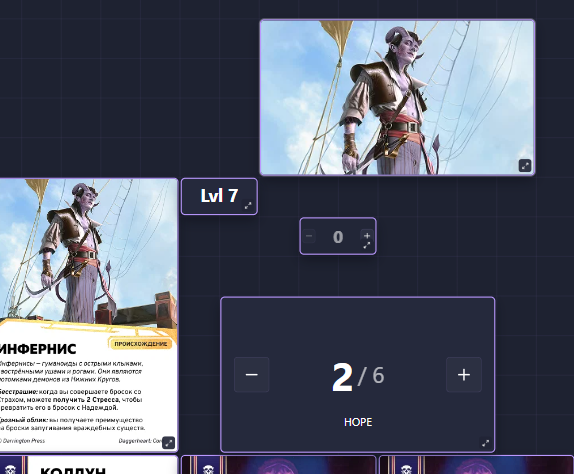
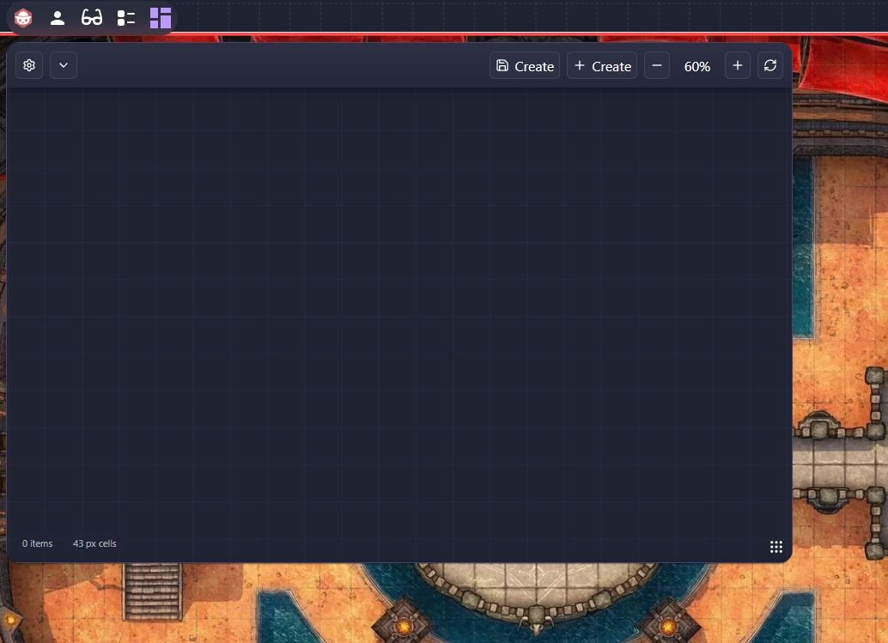
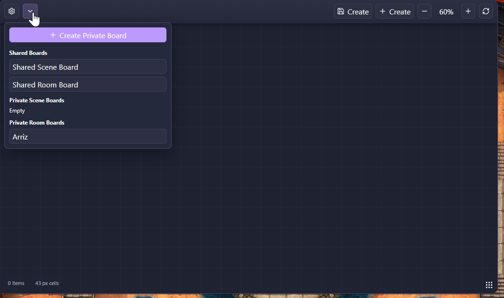
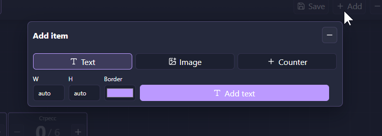
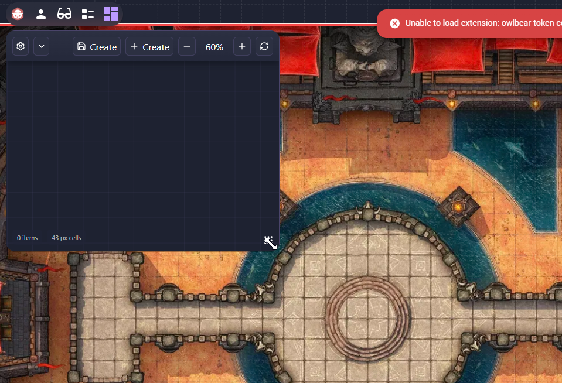
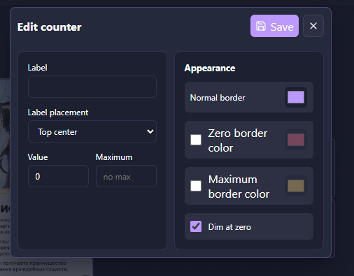
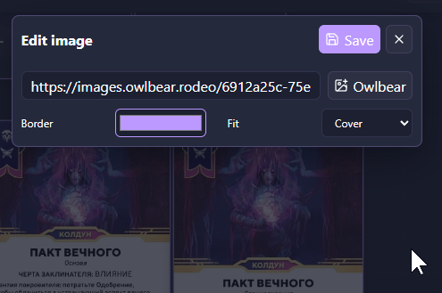
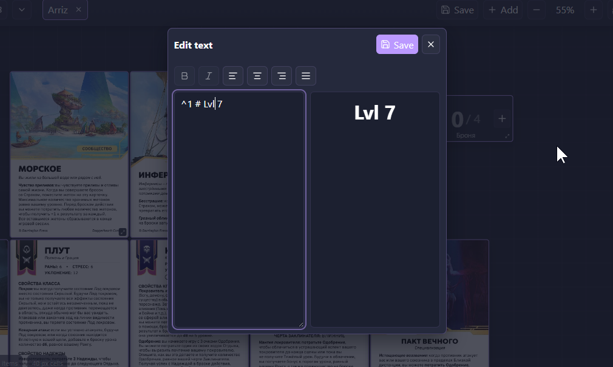
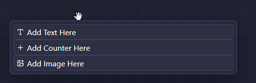

# Owl-Boards

<p align="center">
  <strong>Пользовательские бесконечные доски для Owlbear Rodeo</strong><br />
  Соберите лёгкий Kanban, лист персонажа, панель сессии или любой другой инструмент для своего стола.
</p>

<p align="center">
  <a href="https://www.owlbear.rodeo/"></a>
  
  
</p>

<p align="center">
  <a href="https://raw.githubusercontent.com/Mitfart/Owlbear_Board/refs/heads/main/manifest.json">Установить бета-версию</a> ·
  <a href="https://github.com/Mitfart/Owlbear_Board/issues">Отзывы и запросы функций</a> ·
  <a href="README.md">English version</a>
</p>



> **Бета-проект.** Owl-Boards активно тестируется. Сообщайте о проблемах, предлагайте функции и участвуйте в разработке через [GitHub Issues](https://github.com/Mitfart/Owlbear_Board/issues).

## Установка бета-версии

1. В Owlbear Rodeo добавьте пользовательское расширение по URL его манифеста.
2. Вставьте этот адрес:

   ```text
   https://raw.githubusercontent.com/Mitfart/Owlbear_Board/refs/heads/main/manifest.json
   ```

3. Откройте комнату и нажмите действие **Board** в панели инструментов слева сверху.

Расширение загружается из `manifest.json` — стандартной точки входа расширений Owlbear Rodeo.

## Что можно создать

- **Бесконечные доски** — перемещайтесь и масштабируйте сетку без фиксированных границ; меняйте размер окна расширения и настраивайте рабочее пространство.
- **Текстовые элементы** — ведите заметки сессии, статблоки, списки и сведения о персонажах с форматированием Markdown.
- **Изображения** — добавляйте ссылки на изображения, выбирайте заполнение или вписывание, свободно перемещайте и меняйте размер.
- **Счётчики** — отслеживайте HP, ресурсы, ходы, боеприпасы и любые неотрицательные значения; максимум и визуальные состояния помогают выделить важное.
- **Приватные доски** — храните подготовку и личные заметки отдельно, для текущей сцены или всей комнаты.
- **Общие доски** — создайте одну общую доску сцены или комнаты для всего стола. Все участники комнаты могут её изменять.
- **Работа с досками** — держите несколько досок во вкладках, используйте отмену/повтор и возвращайтесь к сохранённым позиции и масштабу каждой доски.

## Для настольных игр

Используйте Owl-Boards как компактный **Kanban**, переиспользуемый **лист персонажа**, панель справки мастера, трекер ресурсов группы или визуальную панель сессии. Элементы доски не зависят от объектов сцены Owlbear, поэтому доска остаётся местом для нужной группе информации.

Приватные данные хранятся в метаданных игрока Owlbear, а общие доски — в метаданных комнаты или сцены. Вне Owlbear Rodeo localStorage используется как запасное хранилище. Для общих досок сохраняется последняя версия, поэтому договоритесь с группой, если одновременно редактируете один элемент.

## Скриншоты

| Бесконечная сетка | Выбор доски |
| --- | --- |
|  |  |

| Добавление элементов | Изменение размера |
| --- | --- |
|  |  |

| Редактор счётчика | Редактор изображения |
| --- | --- |
|  |  |

| Редактор Markdown-текста | Действия с элементом |
| --- | --- |
|  |  |

## Разработка

```bash
npm install
npm run dev
```

Запуск целевого набора тестов:

```bash
npm test
```

## Помогите развивать проект

Это alpha/beta-расширение, и отзывы напрямую влияют на его развитие. Создайте [issue](https://github.com/Mitfart/Owlbear_Board/issues) для сообщения об ошибке, запроса функции или идеи; pull request тоже приветствуется.
